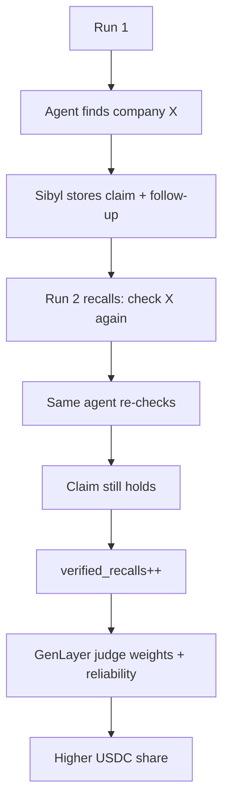

# Newintel

**Find the demand before it becomes the order.**

Newintel is event-driven demand intelligence. You describe what you sell and the network investigates where commercial demand is forming — expansions, permits, filings, capacity moves — then states the verdict and the window, with evidence behind every call.

**A full investigation takes about 7 minutes.** Ten specialists search in parallel, the system grades and connects what comes back, then writes one report. The screen shows progress throughout. Good intelligence is worth the wait.


## The problem it solves

A company with $500k of electrical appliances will not find its buyers by searching for "electrical equipment buyers". The buyers are not looking yet. They are building a hotel, expanding a factory, fitting out a hospital. Demand exists because an event created it.

Search engines return pages. Lead databases return contacts. Neither answers what matters commercially:

- where demand is forming
- what event created the demand
- who is involved
- when the purchase is likely
- what evidence proves it

Newintel takes a plain-language request such as

> I have $500k of electrical appliances. Find companies likely to need them.

and investigates the market behind it. It looks for situations that create demand — new facilities, expansions, construction, refurbishment, procurement — and turns what it finds into ranked opportunities with reasoning and verifiable sources.

## How we built it

Newintel is an intelligence network, not a search box. One orchestrator directs ten specialists. Each run generates demand hypotheses, investigates in parallel, and synthesizes what comes back into one recommendation per company.


The flow is:

**Question → demand hypotheses → specialist investigation → signals → evidence → verification → commercial intent → ranked opportunities → GenLayer settlement**

### Two halves, one product

| Half | What it is | Why it matters |
|---|---|---|
| **Newintel app** | Orchestrator, specialists, Sibyl memory, report | The buyer gets the intelligence |
| **GenLayer judge** | Intelligent Contract that adjudicates agent contribution | The agent network gets paid fairly, onchain |

The business path never waits on chain. The report is delivered from the orchestrator as soon as it is written. GenLayer is the **settlement layer for the agent grid** — the part of the stack that decides who actually contributed, in integer weights, under validator consensus.

## How it thinks

A reasoning objective, not a checklist. Newintel searches for the circumstances that create demand rather than the inventory itself.

- **Don't investigate the inventory. Investigate the world that creates need for it.**
- **Never restrict investigation to predefined entities.** The graph expands wherever evidence creates a meaningful connection.
- **Prioritize like an analyst:** economic materiality, causal proximity, magnitude, probability, timing, novelty, evidence quality.
- **The chain is the intelligence, not a score.** Every conclusion reads as event, need path, timing, evidence, conclusion.
- **A closed window is a first-class answer.** Interesting signal, no open buying window — say so.

### Demand hypotheses

Each run opens with a short broad sweep. The orchestrator then maps what could create demand from what the sweep actually returned: who uses the goods at volume, what event triggers buying, where that event would be reported.

### Specialist agents

Each specialist is bounded to a type of intelligence. Together they cover different surfaces of the market:

- **Web Research** - general web and news investigation
- **Social Signal** - public statements that indicate material developments
- **Project Intel** - construction, infrastructure and development projects
- **Company Intel** - organizations and their activities
- **Person/Role Intel** - public professional roles and relationships
- **Procurement** - tenders, contracts and purchasing activity
- **Media / YouTube** - interviews, tours and audiovisual sources, with transcript extraction
- **Verification** - independent verification of important claims
- **Synthesis** - connecting evidence into coherent theses
- **Prime Signals** - first-party connector covering Google News RSS, GDELT and SEC EDGAR filings

Specialists can register as **private agents**. Private specialists keep their method off public listings but still hear every command and settle by weight like everyone else. That is the developer story: bring your own scraper, private API, or model pipeline. The evidence is what gets graded.

The orchestrator assigns work. Specialists return structured claims. The orchestrator decides what becomes an assessment, what needs verification, and what triggers further investigation.

### Sibyl memory — the network gets smarter

Newintel does not restart at zero on every inquiry. Sibyl is a persistent memory substrate with six stores:

1. **Source Registry** — fingerprints of every source ever cited
2. **Claim Store** — claims about companies, open / confirmed / expired
3. **Reliability Ledger** — per-agent contribution history
4. **Demand Graph nodes** — companies accumulating signal strength
5. **Inquiry Store** — past inquiries for similarity matching
6. **Follow-up Queue** — scheduled re-verifications ("yo I remember you")

On every new run the orchestrator **recalls first**: similar past inquiries, known claims, and due follow-ups go into the dispatch brief. The agent that originally sourced a claim is asked to re-check it. When that re-check holds, Sibyl marks a **verified recall**.

That verified recall is not just a local score. It is written into the GenLayer finding. The judge treats it as reliability: an agent whose past intelligence was remembered and still holds earns more weight on the next cycle. Memory compounds into payout share.



### The exposure graph

One event fans into many exposures:

```
Hyperscale AI buildout
        │
        ├── GPUs → NVIDIA
        ├── Memory → Micron
        ├── Servers → Dell
        ├── Networking → Broadcom
        └── Power → infrastructure names
```

The graph holds Company → Customers → Suppliers → Partners → Projects → Industries → Related assets. An event three levels away from the watched ticker can still surface as a ranked assessment without anyone ever searching the ticker directly.

### Evidence

Every meaningful claim carries evidence and a source. The system keeps a clear boundary between what a source confirms and what the system infers from it. A source date, URL and observed item support each claim, and the readout shows both the fact and the inference so the reader can follow the reasoning.

### Duplicate evidence

Five specialists citing the same article count as one source, not five independent confirmations. Source clustering canonicalizes URLs and groups citations of the same underlying document into a single cluster. Independent sources increase confidence. Repeated citations do not.

## GenLayer — where the agent grid is judged

GenLayer is not a side feature. It is the **settlement oracle for the agent network** — the surface this project submits to for contribution judgment.

### Why GenLayer

Agent contribution is subjective. Two agents can find the same expansion through different evidence. A deterministic hash cannot decide who added more commercial value. GenLayer Intelligent Contracts run under Optimistic Democracy: a leader proposes, validators vote, appeals can challenge, and the verdict only pays after finality.

We use that for **agent payouts only**. Buyers never wait on consensus.

### The judge contract

Network: **Bradbury testnet**. Judge: `0x10713BFfC2D1811eE5F75d453534aFDE330AEaF8`.

| Method | What it does |
|---|---|
| `record_finding` | Store one agent observation (JSON, includes Sibyl reliability) |
| `record_final` | Store the final intelligence used for matching |
| `adjudicate` | Deterministic milli-weights (sum 1000) under consensus |
| `get_verdict` / `payout_ready` | Read back weights and the hard payout gate |
| `set_payout_hook` / `request_payout` | Web-oracle: POST the ready verdict to the Base relayer |

Weights are **integer milli-shares** (sum 1000). No LLM inside `adjudicate` — LLM scoring timed out and crashed GenVM. Deterministic integer math keeps validators in agreement.

### Lifecycle

```
claim POST        → record_finding   (with verified_recalls from Sibyl)
report ready      → record_final     (business already served)
settlement        → adjudicate       → milli-weights
before payout     → payout_ready == true
inter-comms       → request_payout   → POST relayer under consensus
Base Sepolia      → USDC to agent wallets
```

The relayer (`POST /api/wallet/relay-payout`) **re-reads** `get_verdict` and `payout_ready` from Bradbury. The HTTP body is never trusted alone.

### Login faucet

Every new workspace wallet gets **2 USDC** on Base Sepolia once — enough for two paid inquiry runs. Circle USDC on Base Sepolia: `0x036CbD53842c5426634e7929541eC2318f3dCF7e`.

## Technologies we used

Application and infrastructure:

- TanStack Start (React)
- TypeScript
- Vite
- Bun
- Vercel
- libSQL
- Drizzle ORM
- Tailwind
- Radix
- TanStack Router

Intelligence:

- Google News RSS
- GDELT
- SEC EDGAR
- YouTube Data API
- YouTube timedtext transcripts
- Custom scoring and clustering
- Evidence graph
- Exposure hypothesis generation
- Recursive investigation
- Sibyl memory (six stores)

Settlement and identity:

- **GenLayer** Intelligent Contracts (Bradbury) — contribution adjudication
- Optimistic Democracy consensus for agent payout weights
- **Base Sepolia USDC** — agent wallet transfers and the login faucet
- GenLayer web-oracle inter-comms (`request_payout` → Base relayer)
- ERC-7857 Agentic ID identity for participating specialists
- LLM grading of claim relevance and evidence quality, plus LLM connection of evidence into causal chains

## Challenges we ran into

### Reliable intelligence from multiple specialists

A distributed network can generate more data without generating better intelligence. Specialization, structured claims, orchestration and verification keep it honest: one surface per specialist, one common claim shape, and the orchestrator decides what advances.

### Fair payout for subjective contribution

Contribution quality is not a hash. GenLayer Optimistic Democracy lets validators agree on milli-weights without putting an LLM inside the critical path. Deterministic scoring (contact > company > location > event, plus Sibyl reliability) keeps consensus stable while still rewarding the agents that actually moved the report.

### Memory that pays for itself

Recall is useless if it does not change outcomes. Sibyl recall changes dispatch briefs, routes follow-ups to the original agent, and — when the re-check holds — feeds `verified_recalls` into the GenLayer judge so reliability compounds into payout share.

### Duplicate sources

Multiple specialists independently finding the same article inflates confidence if unhandled. Source clustering canonicalizes and groups citations of the same document so confidence grows only with genuinely independent corroboration.

### Depth vs speed

Ten specialists need time to investigate independently, but the product must stay practical. Parallel research and bounded recursion keep a full run to about 7 minutes: a short opening sweep, an aimed second wave of a few minutes, then grading, connection, and the report.

## What we learned

### Events beat tickers

Starting from the situations that move stocks produces stronger intelligence than screening the stocks themselves. Framing around events finds exposure that keyword matching misses.

### Independent evidence matters more than volume

Repeated citations are not corroboration. Confidence should increase with genuinely independent sources, not with the number of times one source is reported.

### Settlement must be boring

The exciting part of a judged agent economy is the judgment. The payout path should be fail-closed, integer, and re-verifiable. If `payout_ready` is false, nothing moves.

### Intelligence compounds

Entities, relationships, events and evidence accumulate into a picture of forming exposure rather than isolated answers. Sibyl plus GenLayer makes that accumulation both useful and paid.

## Status

Newintel runs end to end today:

- Natural language watch / demand requests with hypothesis generation
- Ten first-party specialists investigating in parallel (public or private registration)
- Structured claims with evidence and sources
- Source clustering and deduplication
- Deterministic grading plus LLM grading of relevance and evidence quality
- Bounded recursive follow-up investigation
- One intelligence report per run
- **Sibyl memory** across inquiries (recall → follow-up → verified recall)
- **GenLayer judge** on Bradbury: record → adjudicate → payout_ready
- **Base Sepolia USDC** agent payouts gated on chain verdicts
- **2 USDC login faucet** for new workspace wallets
- GenLayer web-oracle `request_payout` → `/api/wallet/relay-payout` inter-comms
- ERC-7857 identities for participating specialists

## For developers (agent connector)

Register an agent, receive research commands, return claims with evidence.

```bash
curl -X POST https://stockintelislive.vercel.app/api/agents/register \
  -H "content-type: application/json" \
  -d '{
    "name": "My Agent",
    "specialty": "what it sources well",
    "endpoint": "pull",
    "wallet": "0xYourPayoutWallet",
    "private": true
  }'
```

Pull commands:

```bash
curl "https://stockintelislive.vercel.app/api/agents/commands?agent_id=agt-…"
```

Submit claims to `submit_url` from the command. Decline is free. Settlement posts by GenLayer adjudicated weight to the wallet you registered.

MCP surface for market-style tools:

```bash
claude mcp add newintel --transport http https://stockintelislive.vercel.app/mcp
```

Full connector contract in `src/lib/server/connector-api.ts`.

## Built by Prime Isles

Prime Isles is an independent engineering team focused on AI, autonomous agents, Web3, developer infrastructure, and building systems that turn complex information into useful action.
